# Runner Fatigue & Form Report

## Overall Race KPIs
|   Fatigue Resistance |   Postural Integrity |   Rhythm Control |   Cadence (spm) |   Hip Drop % Pelvis |   Asymmetry Index (higher=worse) |   Trunk Lean (deg) |   Dynamic Symmetry |   Arm-Leg Phase Lock |
|---------------------:|---------------------:|-----------------:|----------------:|--------------------:|---------------------------------:|-------------------:|-------------------:|---------------------:|
|              60.3237 |              54.7558 |          71.8896 |         103.045 |             19.4958 |                          38.1676 |           -1.33785 |          0.0839097 |             0.984473 |

### Technique Evolution (Start -> End)
| label                          |     start |       end |      delta | better_direction   |
|:-------------------------------|----------:|----------:|-----------:|:-------------------|
| Cadence (spm)                  | 97.307    | 92.967    | -4.33998   | higher_or_stable   |
| Asymmetry Index (higher=worse) | 34.4925   | 44.522    | 10.0295    | lower              |
| Hip Drop % Pelvis              |  6.68369  |  5.04895  | -1.63473   | lower              |
| Relative Lumbar Lean (deg)     | -2.5495   | -2.18323  |  0.36627   | closer_to_early    |
| Arm-Leg Phase Lock             |  0.964152 |  0.977209 |  0.0130575 | higher             |

- **Cadence:** step frequency trend with fatigue.
- **Asymmetry Index:** higher means left-right imbalance is greater (worse).
- **Hip Drop % Pelvis:** lower means better frontal-plane pelvic control.
- **Relative Lumbar Lean:** drift from early-race trunk posture baseline.
- **Arm-Leg Phase Lock:** higher means tighter upper/lower coordination timing.

### Speed Linkage (split-time based)
| metric                    |   corr_with_speed |
|:--------------------------|------------------:|
| cadence_steps_per_min     |        0.281078   |
| asymmetry_index           |       -0.903934   |
| hip_drop_pct_pelvis_width |        0.358609   |
| trunk_lean_deg_mean       |        0.165434   |
| arm_leg_phase_lock        |        0.00116933 |
| tdi_total                 |        0.689131   |

### Overall Insights
- Cadence trend: 97.31 -> 92.97 spm (down).
- Overstriding trend: 0.083 -> 0.249 (up).
- Lateral head movement trend: 3.78 -> 5.47 px SD (up).
- Hip Drop % Pelvis trend: 6.68% -> 5.05% (down).
- Asymmetry Index trend: 34.49 -> 44.52 (up).
- Asymmetry index vs speed correlation: -0.90.
- Technique Decay Index vs speed correlation: 0.69.
- Technique Decay Index vs race time correlation: -1.00.
- Technique Decay Index trend: 1.124 -> 0.772 (decreasing through race).
- Cadence trends downward late race, indicating rhythm fatigue.
- Costly compensation appears in 2 segment(s); focus drills there.
- Cadence-speed correlation is 0.28 (split-based pace linkage).
- Asymmetry index vs speed correlation is -0.90: more asymmetry is linked to lower speed.

## Segment Overview
| segment    |   est_start_m |   est_end_m |   duration_sec |   cadence_steps_per_min |   cadence_stability_index |   stride_time_drift_pct_vs_s1 |   duty_factor_proxy |   hip_drop_px_p90 |   hip_drop_pct_pelvis_width |   asymmetry_index |   trunk_lean_deg_mean |   head_pelvis_coupling_ratio |   dynamic_symmetry_index |   tdi_total |   fatigue_resistance_score |   postural_integrity_score |   rhythm_control_score |
|:-----------|--------------:|------------:|---------------:|------------------------:|--------------------------:|------------------------------:|--------------------:|------------------:|----------------------------:|------------------:|----------------------:|-----------------------------:|-------------------------:|------------:|---------------------------:|---------------------------:|-----------------------:|
| segment_01 |       534.106 |     554.562 |        4.26624 |                 97.307  |                   nan     |                        0      |            0.405405 |         0.220537  |                     6.68369 |           34.4925 |             -2.5495   |                     0.776341 |                0.0888819 |    1.1237   |                     5      |                    7.12966 |                95      |
| segment_02 |       717.094 |     743.636 |        5.23281 |                151.822  |                   nan     |                      -35.9073 |            0.39759  |         0.0948146 |                     5.19071 |           35.4907 |             -0.68294  |                     0.830481 |                0.0750613 |    1.03388  |                    21.3401 |                   22.5526  |                 5      |
| segment_03 |       856.176 |     937.138 |       13.1987  |                 95.5198 |                   118.061 |                       68.059  |            0.4      |         1.16695   |                    28.9101  |           38.5012 |              0.214147 |                     0.183399 |                0.103644  |    0.995491 |                    32.9823 |                    5       |                93.7398 |
| segment_04 |      1277.23  |    1328.89  |       10.3656  |                105.205  |                   118.979 |                      -20.4633 |            0.402597 |         0.218053  |                    41.2788  |           31.249  |             -1.90101  |                     0.340546 |                0.0589541 |    0.818932 |                    86.5206 |                   95       |                76.7725 |
| segment_05 |      1439.52  |    1500     |       15.2651  |                 92.967  |                   126.936 |                       32.8185 |            0.399061 |         0.286401  |                     5.04895 |           44.522  |             -2.18323  |                     0.264808 |                0.085436  |    0.772326 |                    95      |                   94.798   |                66.1522 |

## What Changed During the Race
- Adaptation demand peaks in **segment_01** (highest `tdi_total`).
- Cadence control and stride timing drift change across segments, indicating fatigue-related rhythm adaptation.
- Posture metrics (`trunk_lean_deg_mean`, `head_pelvis_coupling_ratio`) and pelvic control (`hip_drop_pct_pelvis_width`) fluctuate with distance.
- Symmetry/coordination metrics (`dynamic_symmetry_index`, `arm_leg_phase_lock`) show where control becomes less consistent.

## What This Means for You
- Cadence/rhythm drift shows how quickly stride timing adapts as fatigue accumulates.
- Trunk/head/pelvis changes show where posture strategy shifts from early to late race.
- Left-right symmetry and phase-lock changes show coordination adaptations under fatigue.

## If This Improves, Your Time Improves Because...
- Better rhythm control reduces braking and keeps speed with less energy cost.
- Better postural integrity limits energy leaks through trunk/pelvis motion.
- Better symmetry keeps force production balanced and consistent under fatigue.

## Metric -> Drill -> Cue -> Goal
| metric            | drill                            | cue                       | goal                    |
|:------------------|:---------------------------------|:--------------------------|:------------------------|
| Trunk Lean Drift  | Wall posture runs                | Chest tall, ribs down     | < 1.5 deg drift per km  |
| Stride Time Drift | Metronome race-pace cadence reps | Quick contacts under hips | stride time drift < 10% |

## Visuals
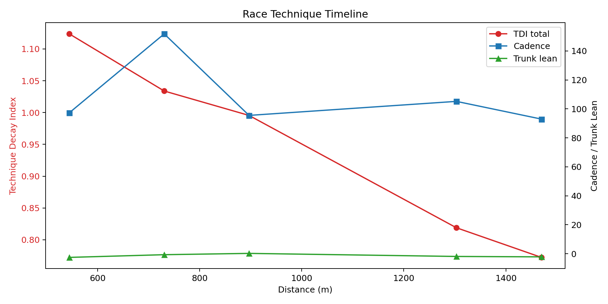
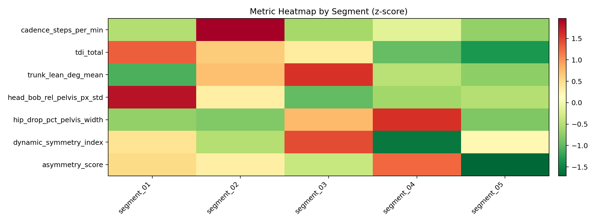
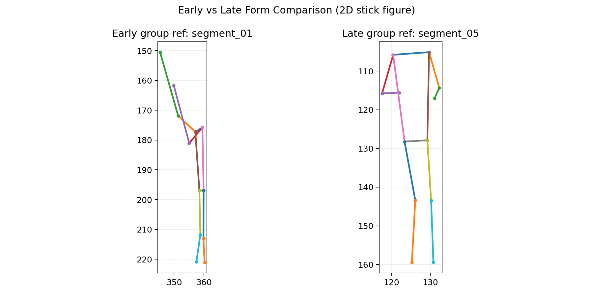
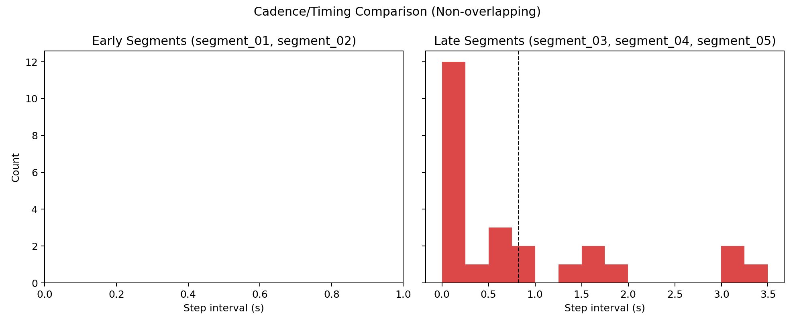
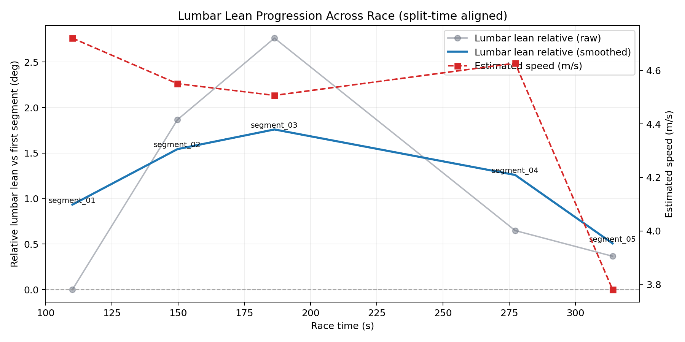
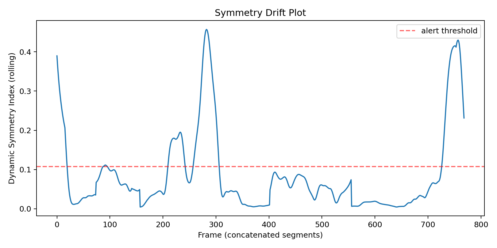
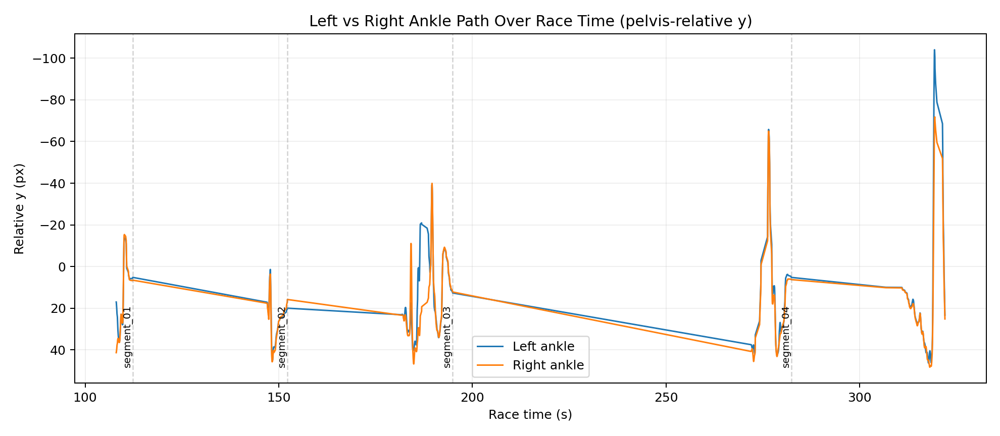
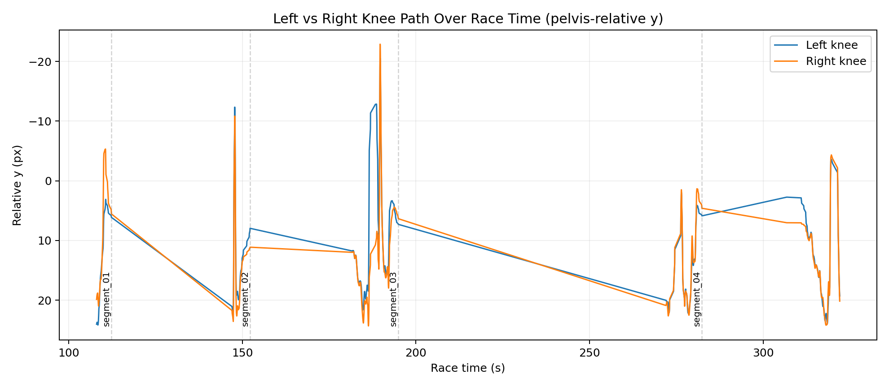
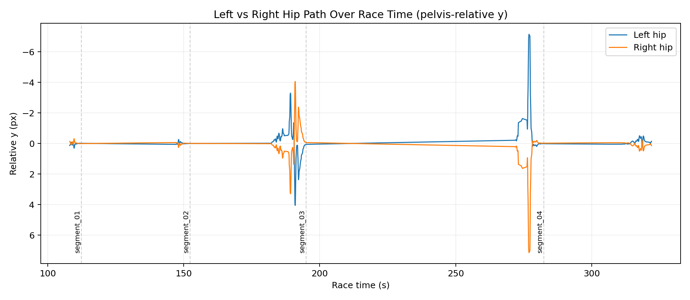
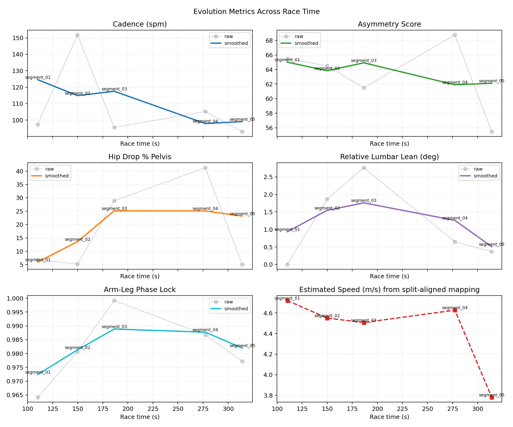
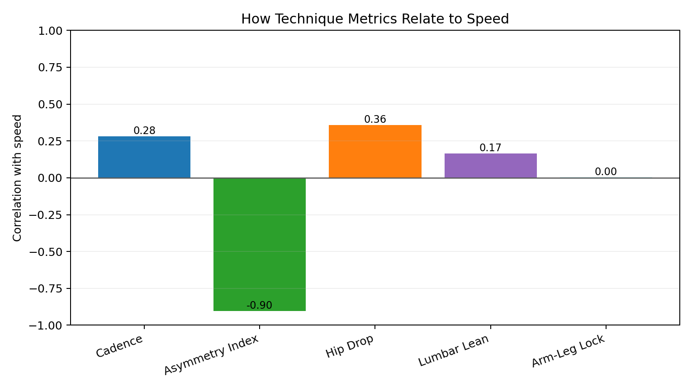
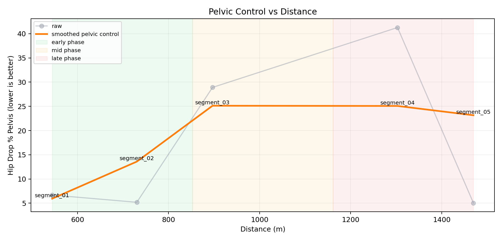
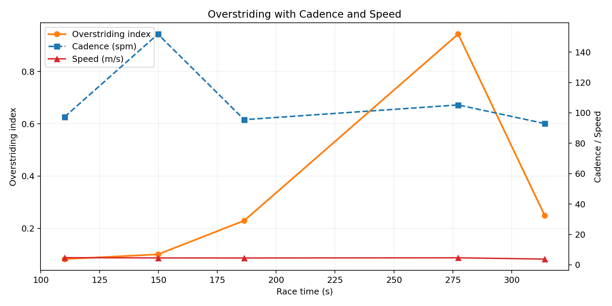

## Notes
- Metrics are 2D proxies and best used for within-athlete trend tracking.
- Clinical diagnosis should use multi-view/3D and expert review.
